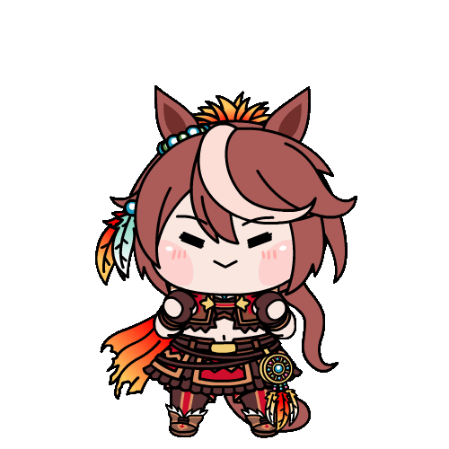
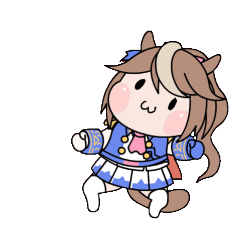
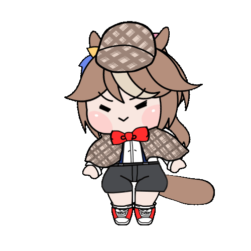

  

  
  

    <samp>
      Helloo!! Projects that I made are in my pins!
    </samp>
  

  

<samp>PROFILE</samp>

   
  

<kbd> Programming Languages  </kbd>  
Python, C, Solidity, HTML, CSS, Rust
 <kbd> 
 

</kbd>

<kbd> Frameworks & Libraries</kbd>  
Pytorch, Tensorflow, Tailwind, Flask, React  
<kbd>
 
 

</kbd>

 

<kbd> Build Tools </kbd>  
Vite, AWS, GCP, Supabase
  <kbd>

</kbd>

<kbd> Tools </kbd>  
VSCode, Git, Github, Obsidian
  </kbd>

</kbd>

  

  ## My Contribution Graph

<picture>
  <source media="(prefers-color-scheme: dark)" srcset="https://raw.githubusercontent.com/hitsukimok/hitsukimok/pacman-output/galaga-contribution-graph-dark.svg">
  <source media="(prefers-color-scheme: light)" srcset="https://raw.githubusercontent.com/hitsukimok/hitsukimok/pacman-output/galaga-contribution-graph.svg">
  
</picture>

  

    <samp>View my repo for more cool stuff</samp> 
  

  

